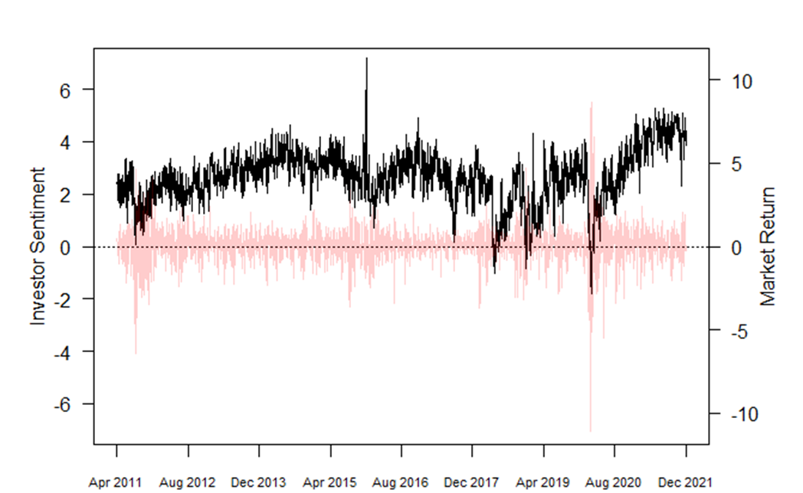
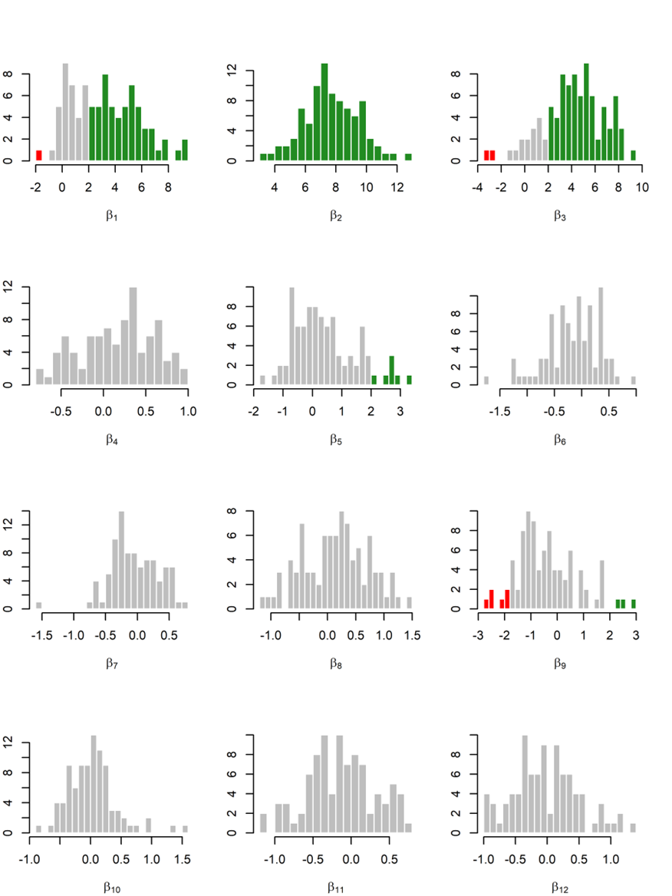

[](http://quantlet.de/)

## [](http://quantlet.de/) **sent-vol-network** [](http://quantlet.de/)

```yaml

Name of Quantlet: sent-vol-network

Published in: under review

Description: Performs a quantitative analysis of the impact of investors' sentiment on the volatility networks in financial markets

Keywords: investors' sentiment, volatility, volatility network, network regression, US financial markets

Author: Dan Anghel and Petre Caraiani

Submitted:  Wed, June 19 2024 by Petre Caraiani


```



